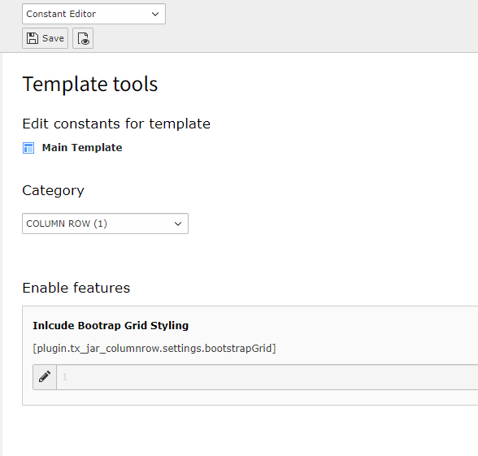

.. include:: /Includes.rst.txt
.. highlight:: typoscript
.. index:: Include Bootrap Grid

.. _configuration-bootstrapgrid:

=====================
Include Bootrap Grid
=====================

.. confval:: bootstrapGrid

   :type: bool
   :Default: true

   If :php:`true`, the bootstrap grid css is included for basic grid styling.

   Example::

      plugin.tx_jar_columnrow.settings {
         bootstrapGrid = true
      }

Change via the Constant Editor
""""""""""""""

