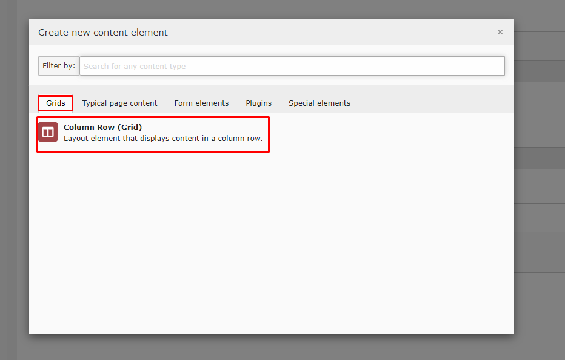
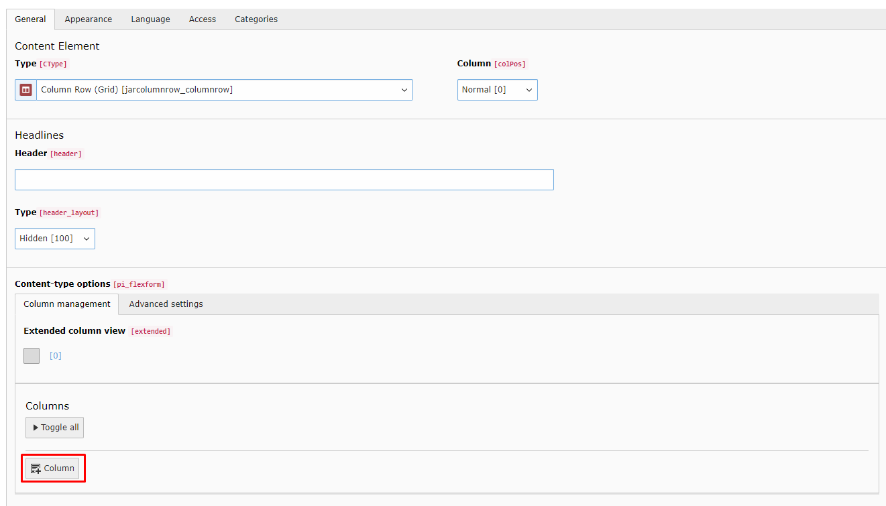
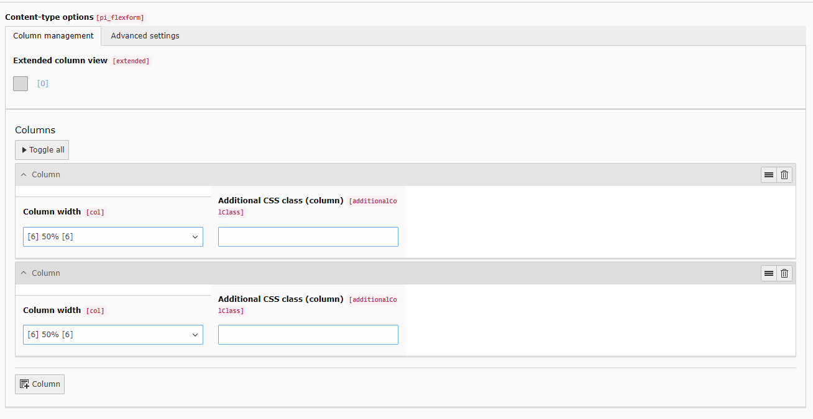
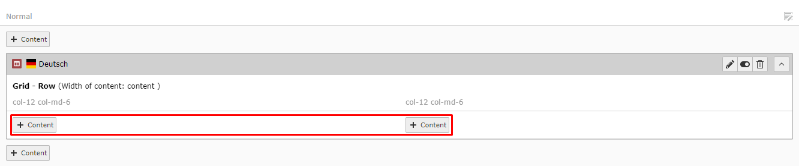

.. include:: /Includes.rst.txt
.. index:: Quickstart
.. _quickstart:

Quickstart
========

Follow the steps below to set up a simple grid element with two rows.

.. _installation:

Installation
----------

Install the extension jar_columnrow via extension manager or via composer (recommended):

.. code-block:: none

	composer require jar/jar_columnrow

You can find the current version (and older ones) at

TBA

Include static template
-----------------------

In your main template include the static template "Jar Column Row" of the extension jar_columnrow.

Add Column Row
------------

Navigate to a page with the page module enabled and add a new content element.
|Choose "Column Row" in the new tab "Grids".

Configure Element
-----------------

You can add new columns in the repeater at the bottom

In basic view you can now choose the width of each column.
For example two columns with 50% each.

After saving and exiting, you can add content elements inside your new column rows either by creating or simply by drag and drop.

